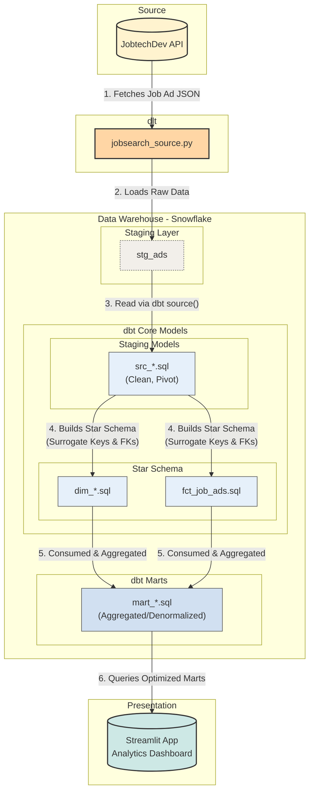

# jobmarket-hr-analytics
The project aims to implement the modern data stack to: - automate the data extraction from Arbetsförmedlingen - transform and structure data - design a dashboard for talent acquisition specialists.

This project was created by: Hugo Lundberg, Katrin Rylander, Masoud Abdisaran, Zamzam Yusuf

This README will guide you through understanding, setting up, and running the project.


### 🛠️ Architecture



### ⚙️ Installation
1. Clone the repository
```
git clone https://github.com/<your-repo>/jobmarket-hr-analytics.git
cd jobmarket-hr-analytics
```

2. Create a virtual environment
```
python3 -m venv .venv
source .venv/bin/activate   # Mac/Linux
.venv\Scripts\activate      # Windows
```

3. Install dependencies
pip install -r requirements.txt

### 🔑 Configuration
1. Create a .env file

In the project root, create a .env file with your Snowflake credentials:

```
SNOWFLAKE_USER="svc_streamlit_app"
SNOWFLAKE_PASSWORD="<PASSWORD_STREAMLIT>"
SNOWFLAKE_ACCOUNT="<ACCOUNT_IDENTIFIER>"
SNOWFLAKE_WAREHOUSE="compute_wh"
SNOWFLAKE_DATABASE="job_ads"
SNOWFLAKE_SCHEMA="marts"
SNOWFLAKE_ROLE="analytics_reader"
```

### 📦 Data Pipelines
1. Load raw data with dlt
```
cd dlt_pipeline
python jobsearch_pipeline.py
```

2. Transform data with dbt
```
cd dbt_code
dbt run
```

### 🖥️ Run the Dashboard

From the streamlit_dashboard folder:

```
streamlit run dashboard_main.py
```

The dashboard opens in your browser (`default: http://localhost:8501`
).
